# Appendix A: Annotation and Notekeeping {.pagetoc-exclude}

## Collaborative web annotation

There are probably others, but here is what I have found so far.

####  hypothes.is {.pagetoc-exclude}

```info
:::: 
:: Tagline: Collaborate with anyone, anywhere. Use Hypothesis to annotate anything online with classmates, colleagues, or friends.
:: Website: <https://web.hypothes.is/>
:: Repository: <https://github.com/hypothesis>
:: Roadmap: <https://web.hypothes.is/product-update/>
```

Many notekeeping options (see below) have plugins for integration with Hypothesis.

{{#tile
:: 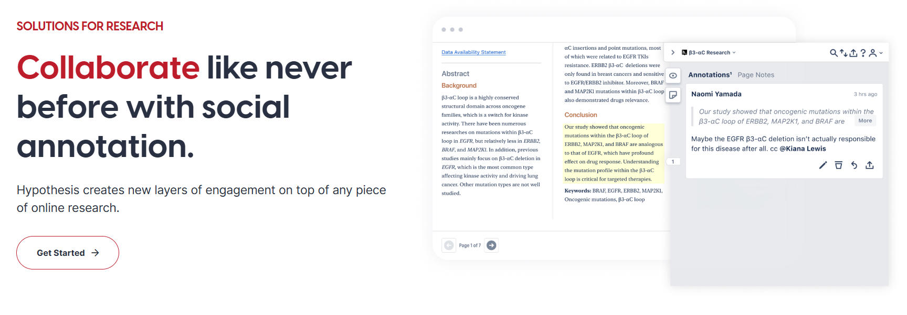
:: 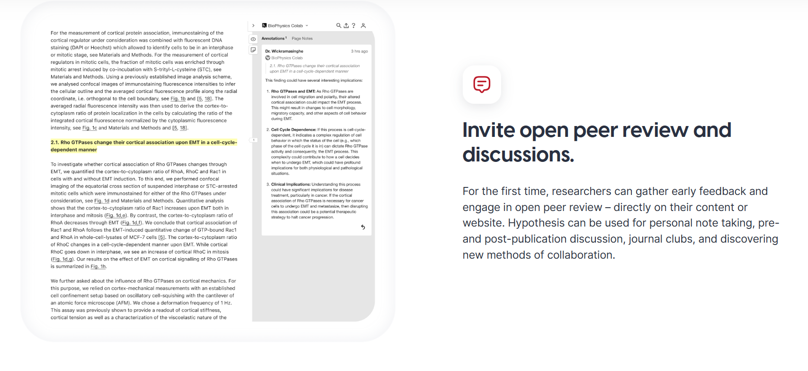
:: 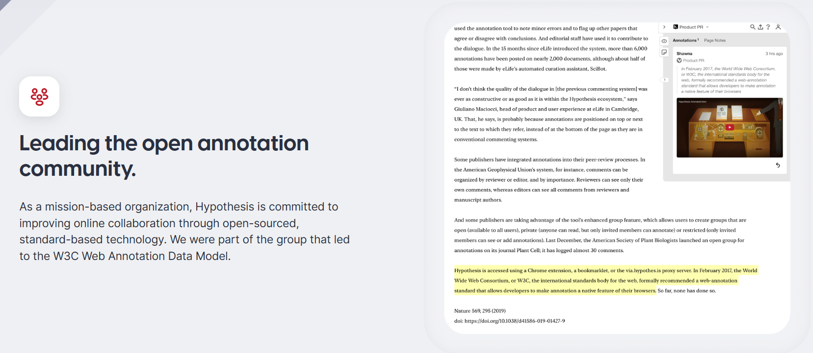
:: 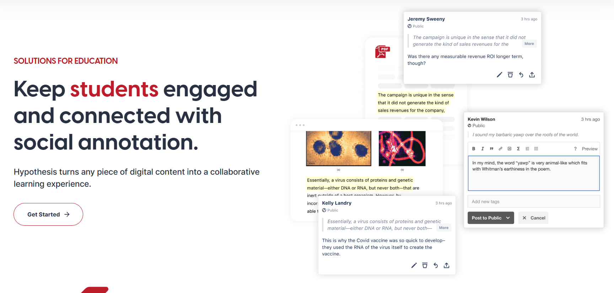
:: 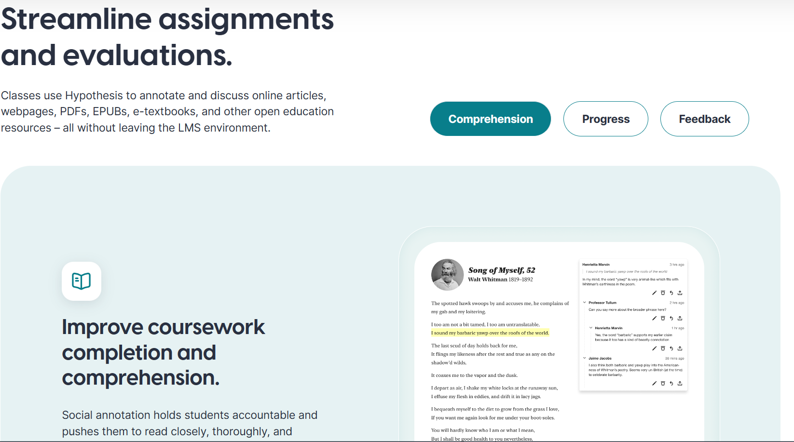
:: 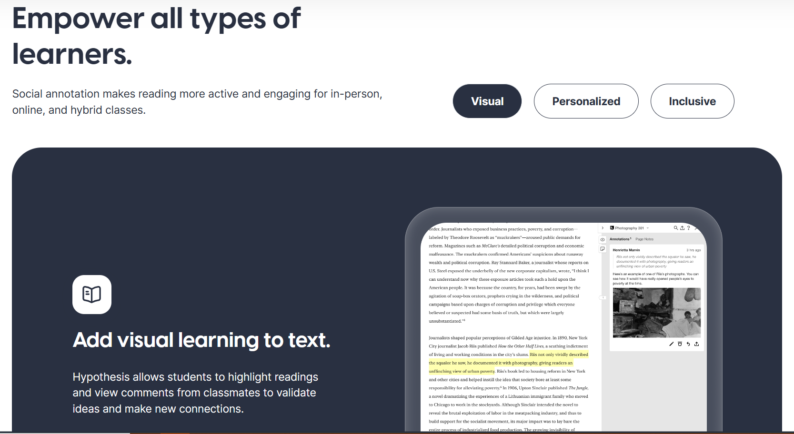
:: 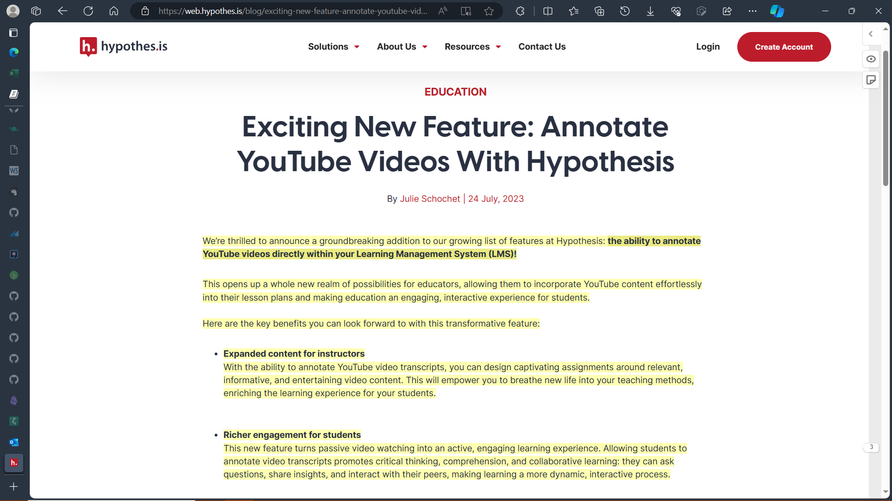
}}

####  Memex {.pagetoc-exclude}

```info
:: Tagline: Organise, annotate & discuss websites, PDFs, YouTube videos without leaving your tab. By yourself, with your peers & enhanced by AI
:: Website: <https://memex.garden/>
```

{{#tile
:: 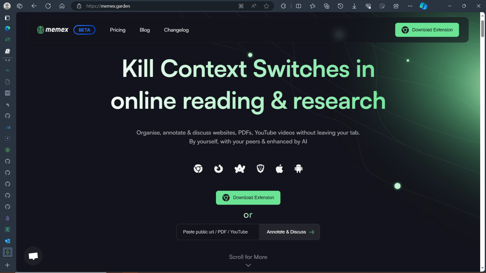
}}


See the website for a demo video for researchers.

## Hierarchical note-taking with backlinks and cross-references

### Primarily Offline Interface

These offer limited real-time collaboration but don't have the same lock-in effect (so you aren't constrained to stay with any particular system, service, or app). Furthermore, unlike the systems that are primarily online services, users can create plugins for them.

#### Obsidian {.pagetoc-exclude}

```info
:: Tagline: Obsidian is the private and flexible note‑taking app that adapts to the way you think.
:: Price: Free; pay for sync hosting <a href="https://obsidian.md/pricing">(pricing here)</a>
:: File format: Markdown (.md)
:: Plugins: <https://obsidian.md/plugins>
:: Website: <https://obsidian.md/>
:: Roadmap: <https://obsidian.md/roadmap/>
```

Supposedly more well-polished and full-featured than Logseq.

Has plugins (2000+) for Hypothesis integration, time-synced notes on audio files, automatic captioning, PDF annotation, [embedded drawings](https://forum.obsidian.md/t/excalidraw-full-featured-sketching-plugin-in-obsidian/17367), chemistry diagrams, integrated terminals, graphical chart editing, flashcards and spaced repetition, and more.

Anyone can develop their own plugins with the plugin API.

Has apps for every major platform.

{{#tile
:: 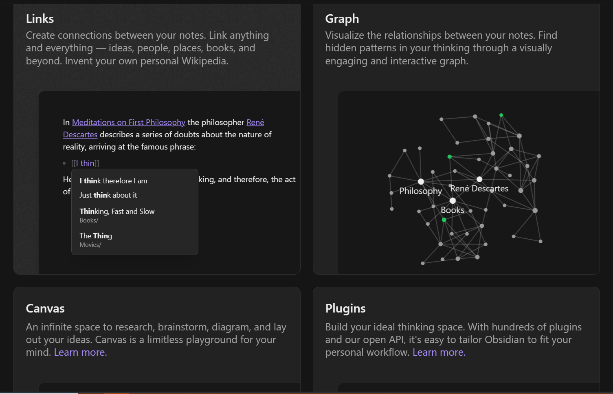
:: 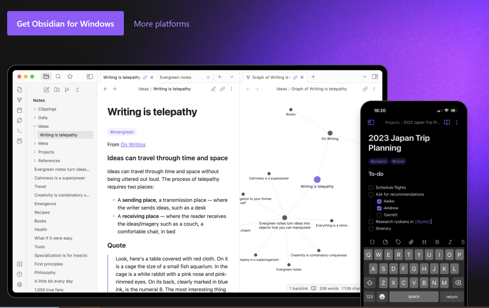
:: 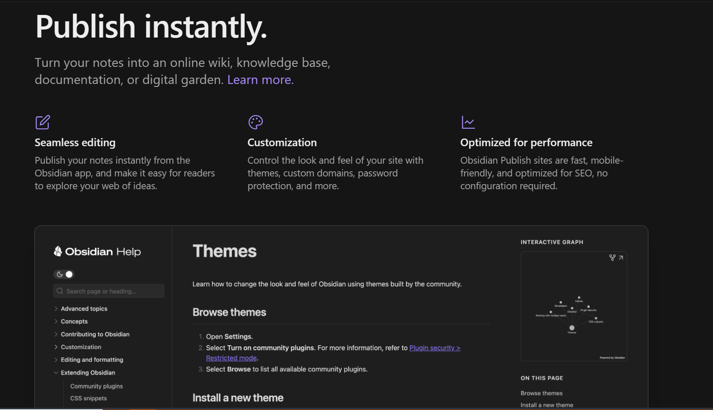
:: 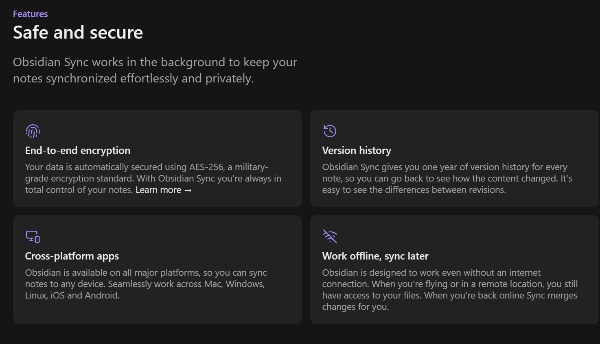
:: 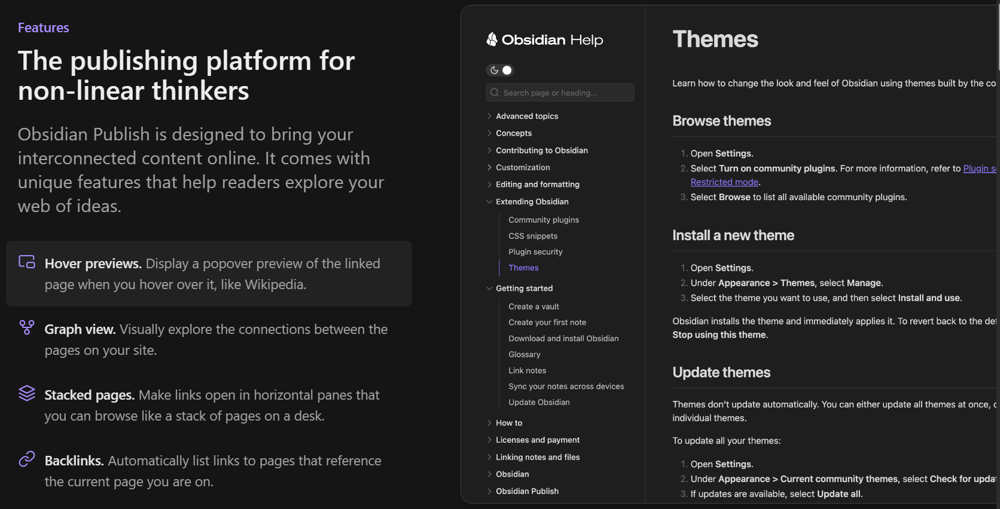
:: 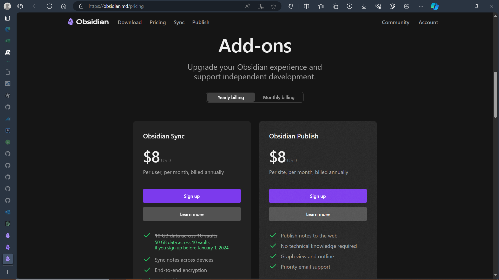
}}


###### Some additional information

+ <https://www.eleanorkonik.com/2021-04-24/>
+ <https://www.reddit.com/r/ObsidianMD/comments/v20eb7/vault_showcase_and_tips_and_tricks/>
+ <https://forum.obsidian.md/t/university-setup-with-lecture-notes-progress-bar-and-more-using-templater-dataview-and-buttons/32094>
+ <https://obsidianninja.com/new-obsidian-showcases-dashboards-movie-library-menu-bar-more/>
+ <https://forum.obsidian.md/t/example-workflows-in-obsidian/1093/24>


#### Logseq {.pagetoc-exclude}

```info
:: Tagline: A privacy-first, open-source knowledge base; <br/>Connect your notes, increase understanding.
:: Price: Free; pay for sync hosting
:: File format: Markdown (.md)
:: Website: <https://logseq.com/>
:: Docs Hub: <https://hub.logseq.com/>
:: Repository: <https://github.com/logseq/logseq>
```

{{#tile
:: 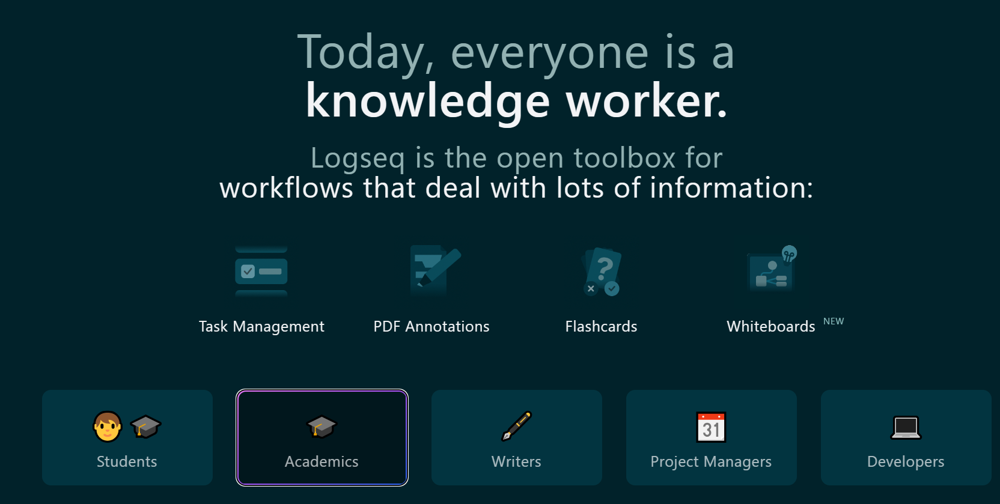
:: 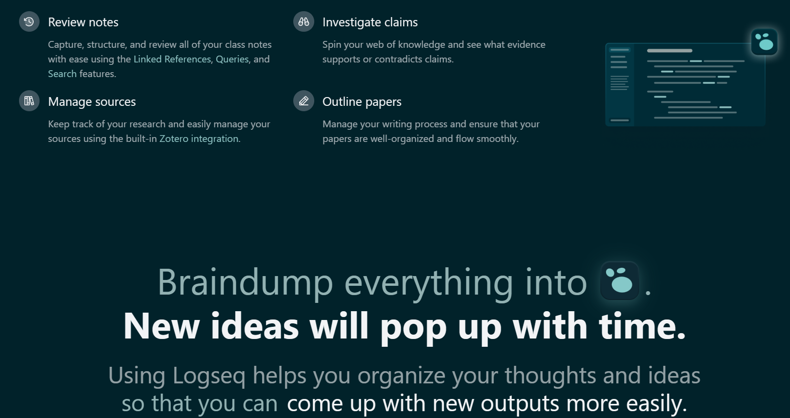
:: 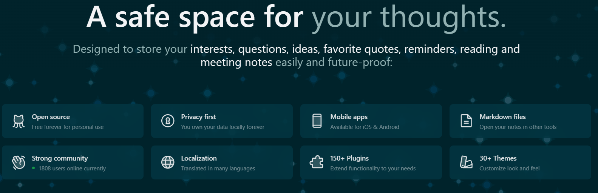
:: 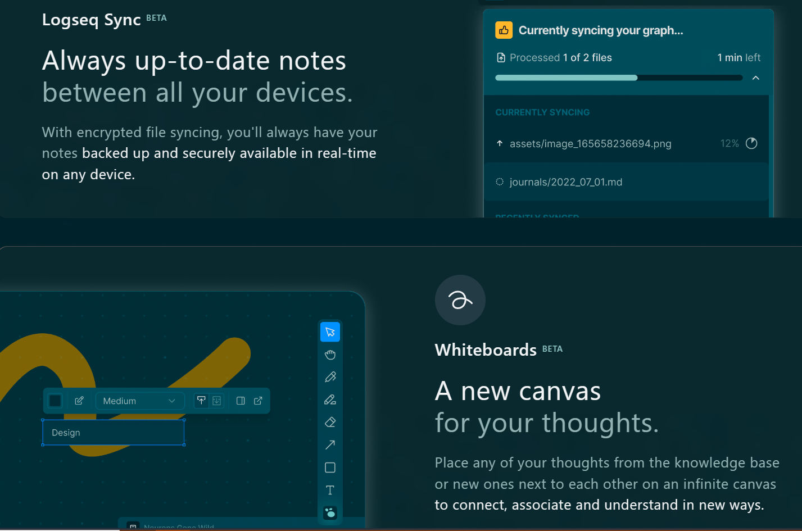
:: 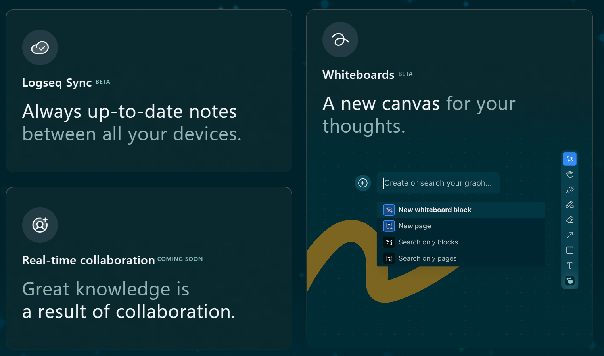
}}

Has plugins (150+) for Hypothesis integration, time-synced notes on audio files, automatic captioning, PDF annotation, embedded drawings, chemistry diagrams, integrated terminals, graphical chart editing, flashcards and spaced repetition, and more.

Anyone can develop their own plugins with the plugin API.

Has apps for every major platform.

#### OneNote {.pagetoc-exclude}

```info
:: Tagline: One cross-functional notebook for all your notetaking needs.
:: Price: included with Office365
:: File format: Proprietary
:: Website: <https://www.onenote.com/>
:: Product Overview: <https://www.microsoft.com/en-us/microsoft-365/onenote/digital-note-taking-app>
```

Perhaps more intuitive to use than Obsidian, and is part of the Microsoft ecosystem. However, there are fewer plugins (for integration with other services) and the notes cannot be edited with other programs.

Offers better real-time collaboration features than the other offline-oriented options.

Has apps for every major platform and a web interface.

### Primarily/Exclusively Online

These offer effortless real-time collaboration (whereas collaboration with the above \[except OneNote] would be more like pushing to a Git repository) but are generally pricier, lack robust offline access to notes, and have much higher lock-in (meaning it's difficult, if not nearly impossible, to migrate to other note systems). Editing using other editors is generally not possible, although usually there are export options. (However, lots of exporting and importing is not convenient and also does not make use of the collaborative features.)

#### Notion {.pagetoc-exclude}

```info
:: Tagline: Notion is the connected workspace where better, faster work happens.
:: Price: Free with limitations; [pricing here](https://www.notion.so/pricing)
:: File format: N/A (no offline interface; some export options)
:: Website: <https://www.notion.so/product>
```

Has apps for every major platform and a web app.

{{#tile
:: 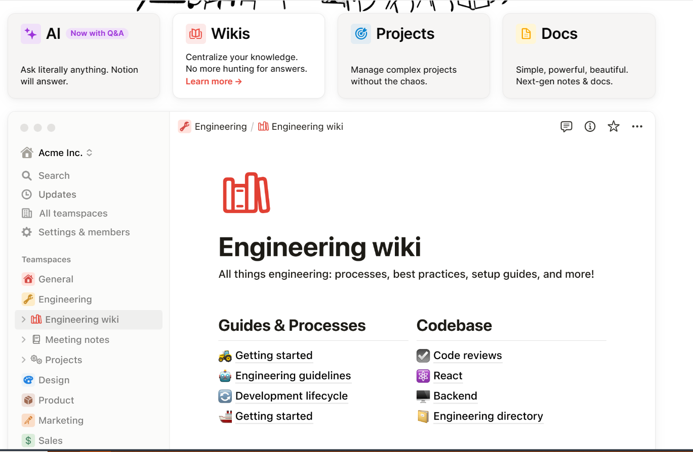
:: 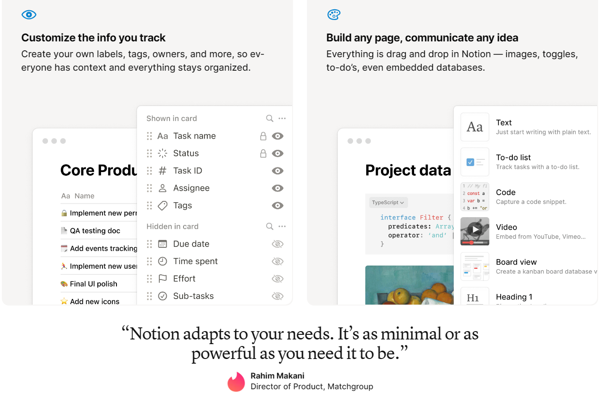
:: 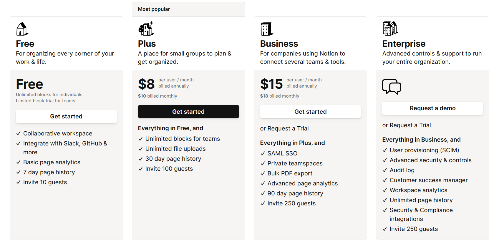
}}

#### Roam Research {.pagetoc-exclude}

```info
:: Tagline: A note-taking tool for networked thought.
:: Price: $15/month, $165/year; $500/5 years
:: File format: N/A (no offline interface; some export options)
:: Website: <https://roamresearch.com/>
:: Demo vids: <https://roamresearch.com/#/app/help/page/2h9V-FtAO>
```

> As easy to use as a document. As powerful as a graph database.
> 
> Roam helps you organize your research for the long haul.

Also has apps for every major platform, as well as a web interface.

{{#tile
:: 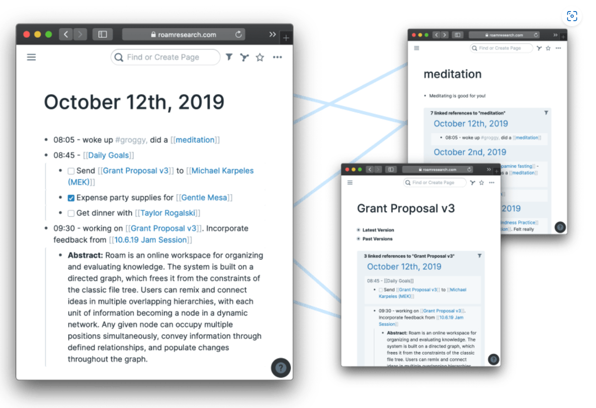
:: 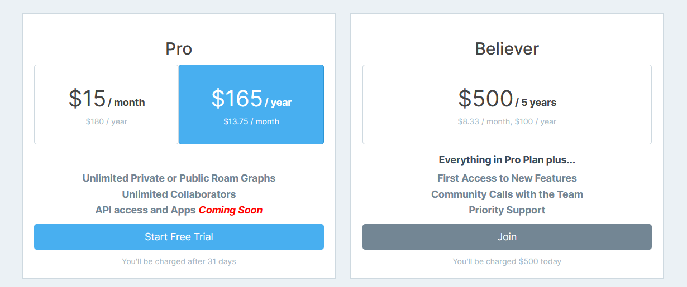
}}


#### Saga.so {.pagetoc-exclude}

```info
:: Tagline: Connected notes, tasks, and tools. For you and your team.
:: Price: Free with limitations ([pricing here](https://saga.so/pricing))
:: File format: N/A (no offline interface; some export options)
:: Website: <https://saga.so/>
:: Roadmap: <https://sagahq.canny.io/>
```

Desktop apps for Windows and Mac (no Linux, mobile, or web interface at the moment).

{{#tile
:: 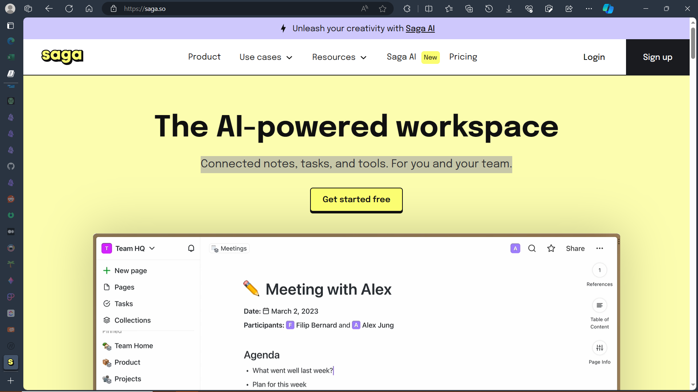
:: 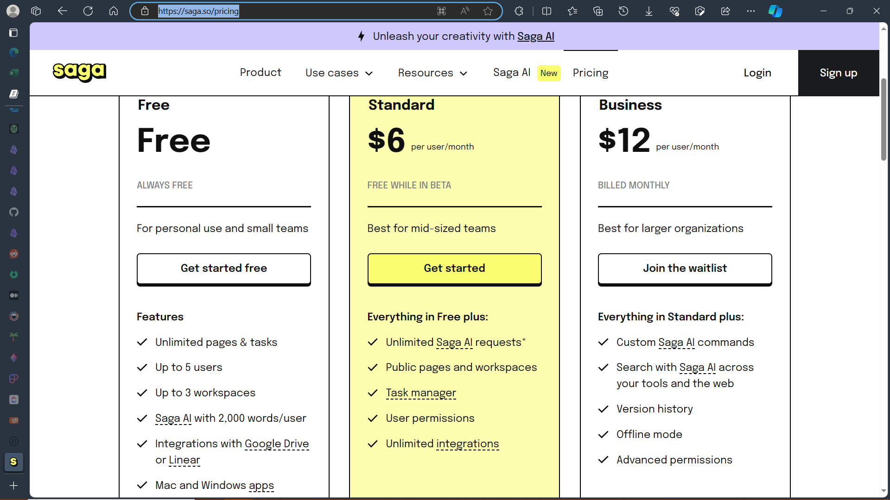
}}

## Markdown editors geared towards research/academia

These are compatible with systems that are based on Markdown (.md) files, such as [Obsidian](#obsidian) and [Logseq](#logseq). (Note that while the online-oriented systems typically also make use of Markdown *syntax*, transparent access to Markdown files is not available.)

#### Zettlr {.pagetoc-exclude}

```info
:::: 
:: Tagline: Your one-stop publication workbench
:: Price: Free
:: File format: Markdown (.md)
:: Website: <https://www.zettlr.com/>
:: Keyboard Ref: <https://www.zettlr.com/shortcuts>
:: Documentation: <https://docs.zettlr.com/>
:: Repository: <https://github.com/Zettlr/Zettlr>
```

> From idea to publication in one app: Zettlr accompanies you while writing your blog post, newspaper article, term paper, thesis, or entire book.

> * **Privacy First:**
>
>    Zettlr is Privacy First: There is no forced cloud-synchronization and all files stay on your computer.
> 
> * **From Idea to Publication:**
> 
>     Manage all your writing projects from one app: From the initial idea to a final publication, already typeset in the appropriate template.
> 
> * **First-class Citation Support:**
> 
>     Hook Zettlr into your reference manager to have all your sources when you need them.

{{#tile
:: 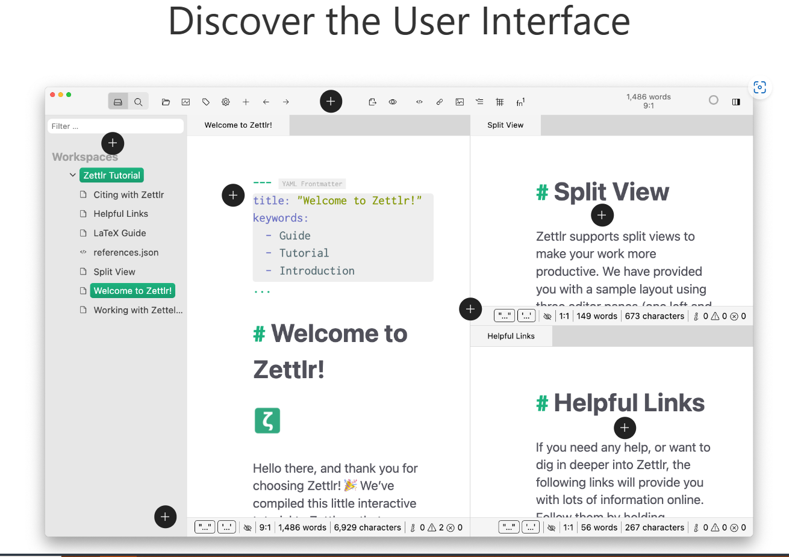
:: 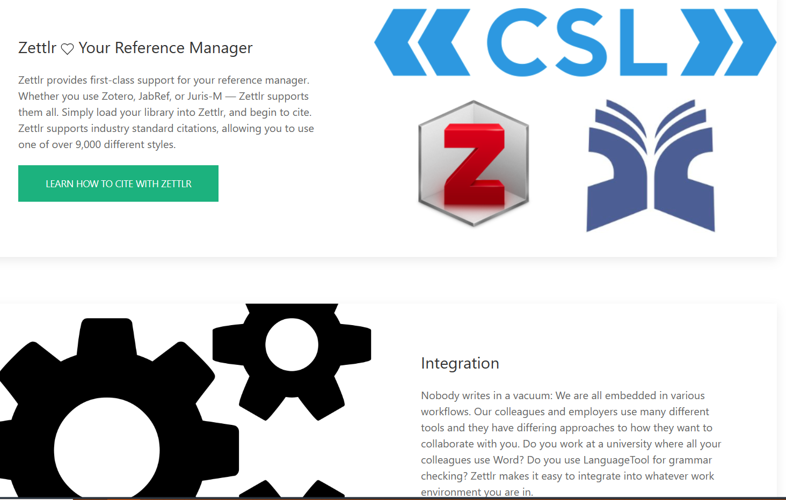
:: 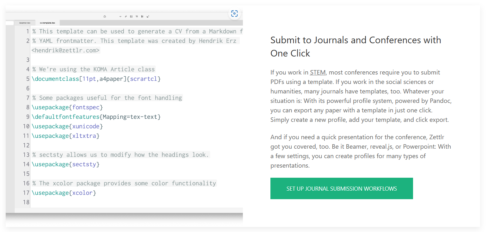
:: 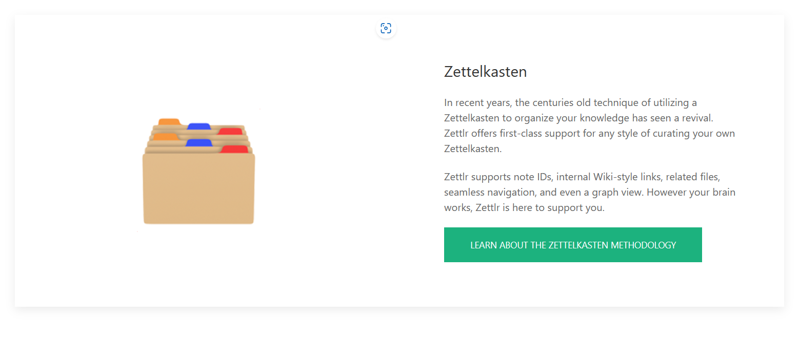
}}

----

## Academic literature and citation management

### Reference Managers

#### Zotero {.pagetoc-exclude}

```info
:: Tagline: Your personal research assistant: Zotero is a free, easy-to-use tool to help you collect, organize, annotate, cite, and share research.
:: Price: Free, with the option to buy additional cloud storage
:: Website: <https://zotero.org>
:: Repository: <https://github.com/zotero/zotero>
```

I've noticed that more note-keeping, citation management, and bibliography tools have integration options for Zotero than do for Mendeley. This leads me to believe that Zotero is more popular / widely used. This could also be due to observation bias since I am personally only familiar with Zotero.

Has apps for all major platforms. Not the prettiest per se, but has plenty of useful features.

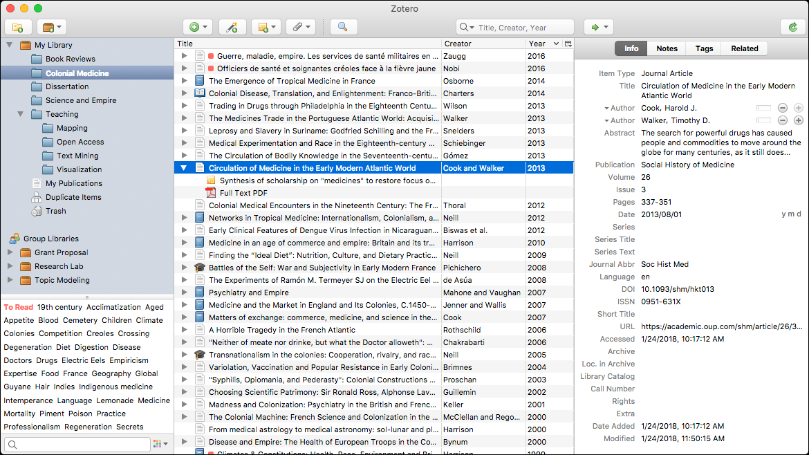

Note also [zoterobib](https://zbib.org/), an officially-endorsed bibliography tool. (Not the same as Zotero, but made by the same development team.)

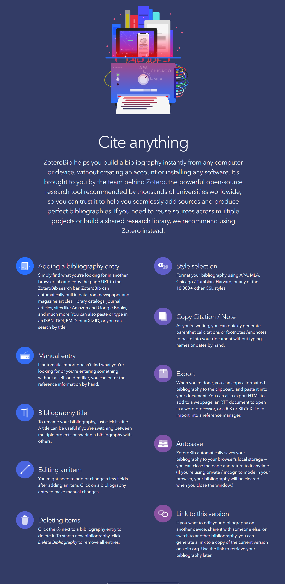

#### Mendeley {.pagetoc-exclude}

```info
:: Price: Probably not free, because Elsevier.
:: Website: <https://wwww.mendeley.com/guides/mendeley-reference-manager/>
```

Appears to be a subset of Elsevier, as its homepage (<www.mendeley.com>) redirected me to the Elsevier website after a short delay.

---

### Article Managers 
#### ReadCube {.pagetoc-exclude}

```info
:::: 
:: Tagline: Transform how your team works with scholarly literature
:: Price: Pricing not listed, but definitely not free
:: Website: <https://www.readcube.com>
```

> ReadCube’s literature management system helps businesses discover, organize, read, annotate, share, and cite research. Simplify your day-to-day so you’re free to make tomorrow’s discoveries.

{{#tile
:: 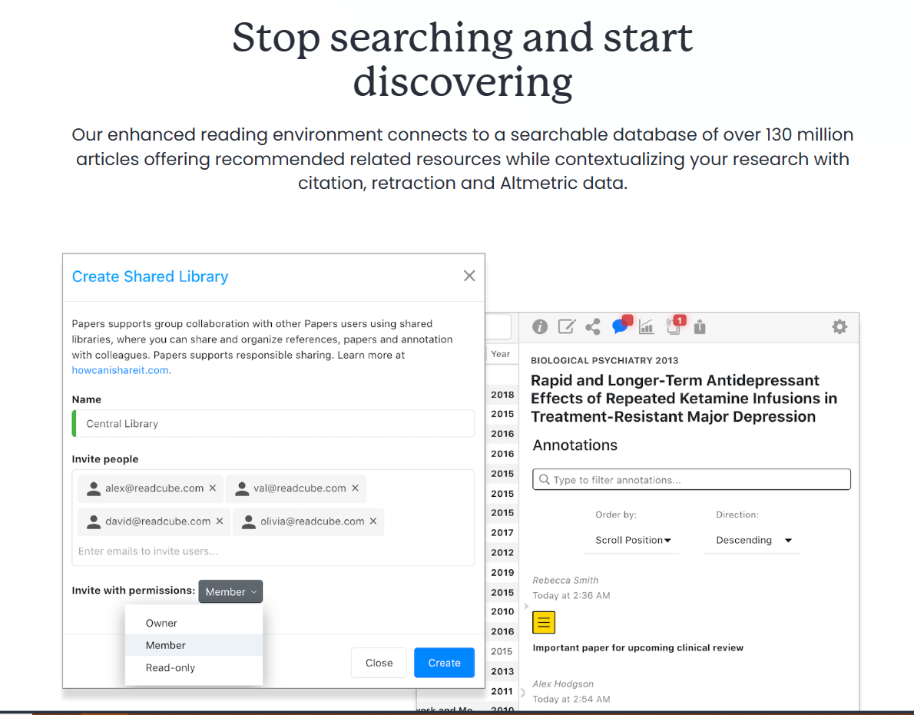
:: 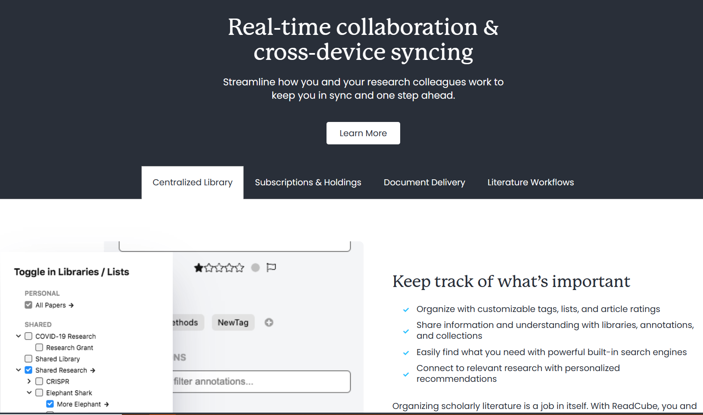
:: 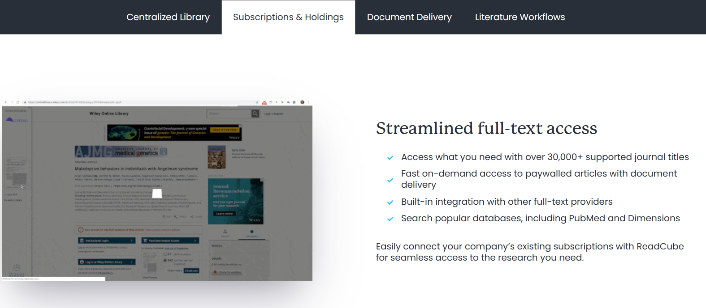
:: 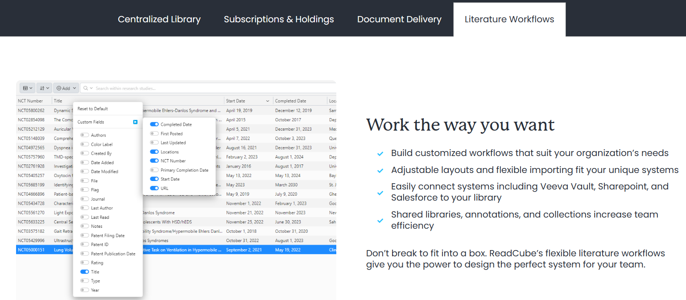
}}


The ReadCube website has [a page](https://www.readcube.com/en/comparison/) where it provides comparisons of its services with those of Rightfind, Article Galaxy, Endnote, and Mendeley. I find it a bit suspicious that it doesn't compare itself with Paperpile or any of the other popular similar services.

#### PaperPile {.pagetoc-exclude}

```info
:::: 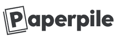
:: Tagline: The no-fuss reference manager for the web;<br/>Manage your research library right in your browser.
:: Price: $2.99/mo ([pricing](https://paperpile.com/pricing/))
:: Website: <https://paperpile.com/>
```

See its [Features](https://paperpile.com/features/) page for an overview. (Categories: Manage References, Find and Collect, Organize PDFs, Highlight and annotate, Share and Collaborate, Cite in Google Docs).

Its [Feature Roadmap](https://paperpile.com/roadmap/) is also available for viewing.

Advertises that it has a plugin for Microsoft Word and Google Docs. It also has mobile apps for Android/iOS.


{{#tile
:: 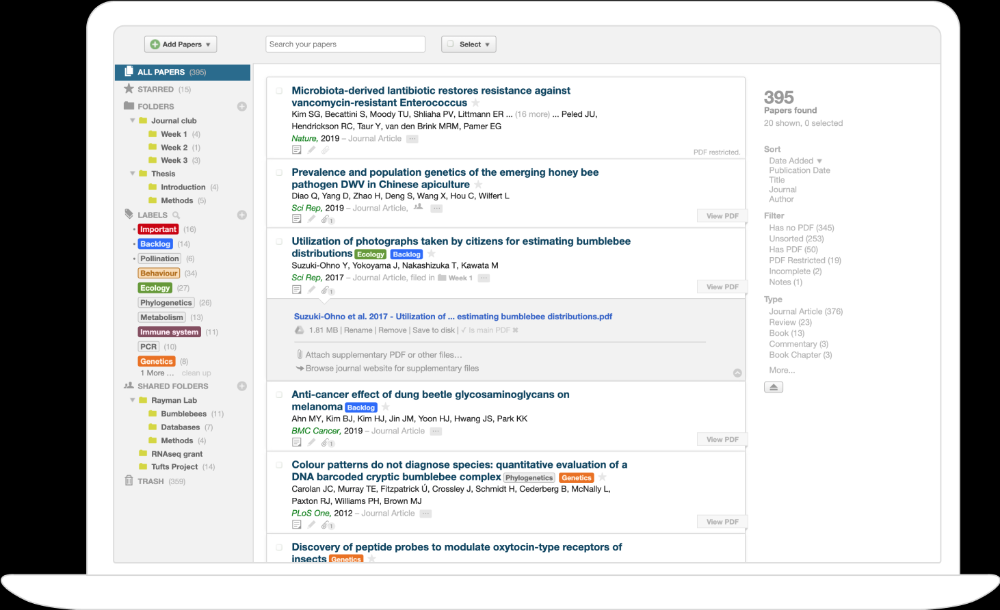
}}

----

### Other
#### PaperMemory {.pagetoc-exclude}

```info
:: Tagline: PaperMemory automatically records and organizes the papers you read, without ever leaving your browser.
:: Price: Free
:: Website: <https://papermemory.org/>
:: Repository: <https://github.com/vict0rsch/PaperMemory>
```

It is a browser extension.

> + **Parse papers you open automatically.**
>
>     Papers are stored in your Memory automatically, without a click. You can then search them, tag them, take personal notes etc.
>
> +  **Match preprints to publications**
> 
>    By querying SemanticScholar, DBLP and CrossRef, PaperMemory can discover the proper publication of Arxiv pre-prints.
> 
> +  You live in your browser? So do your papers
>
>    Share papers to your favorite apps by copying:
>    - a  BibTex entry for  Overleaf
>    - a  Markdown link \[title]\(url) link for  Github,  HackMD or  Notion
>    - a  HyperText link for  emails,  Google Docs,  Slack, etc.
> 
> + Discover code repositories
>     Using the PapersWithCode API, PaperMemory will match code repositories with papers in your Memory.
> 
> +  Enhance ArXiv.org
> 
>     Display the actual pubication venue of published papers, a link to the code repository, copy the BibTex entry etc.
>
> +  Instantly copy `.bib`-compatible bibliography entries
>     Export a paper's BibTex entry directly from the extension, or bulk export BibTex entries by paper tag. You can even use PaperMemory to update the ArXiv entries of a stand-alone `.bib` file.
>
> +  Highly customizable
>
>    Change the theme to light or dark, control the default link copied to your clipboard, add links to SciRate / HuggingFace Papers / Ar5iv / ArxivSanity, trigger parsing manually, export / import papers etc.
>
> +  And many more features!
>     Github Gist synchronization, regex-based automatic paper tagging, arbitrary website parsing to record Blog posts or dataset websites, etc.

:: 
