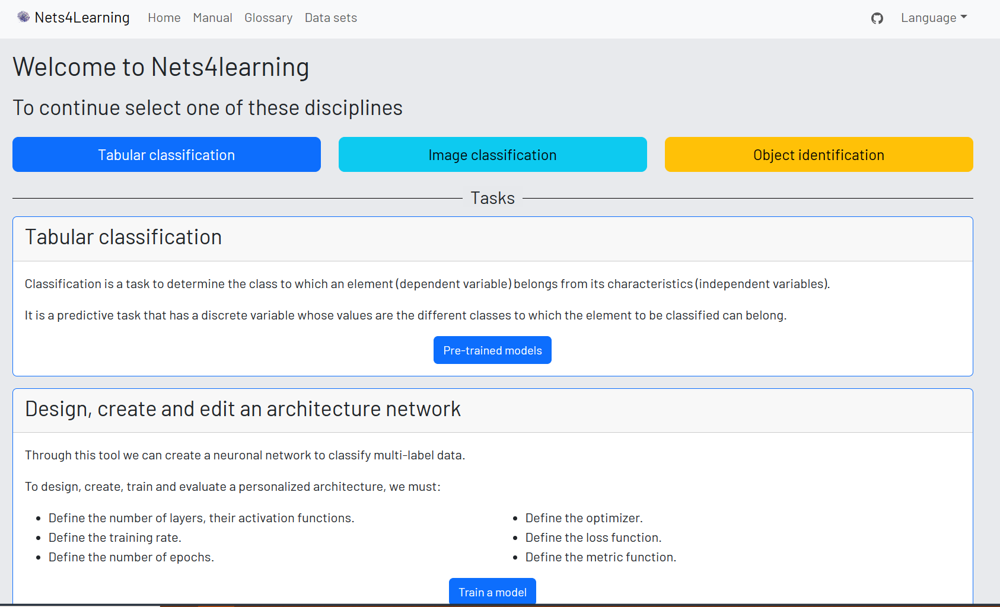

# Background/Theory


## StatQuest with Josh Starmer (YouTube)

```info
:: Tagline: DOUBLE BAM!!!
:: Link: <https://www.youtube.com/channel/UCtYLUTtgS3k1Fg4y5tAhLbw>
```

> Statistics, Machine Learning and Data Science can sometimes seem like very scary topics, but since each technique is really just a combination of small and simple steps, they are actually quite simple. My goal with StatQuest is to break down the major methodologies into easy to understand pieces. That said, I don't dumb down the material. Instead, I build up your understanding so that you are smarter.

<!--<div style="display: flex; flex-flow: row nowrap; justify-content: center; align-content: stretch; justify-items: stretch; justify-content: stretch; width:100%;">
    <div style="flex-grow: 1; background-color: var(--bg-inverted-hwb);">a</div>
    <div style="flex-grow: 1; background-color: var(--bg-inverted-hsl);">b</div>
    <div style="flex-grow: 1; background-color: var(--bg-inverted-rgb);">c</div>
    <div style="flex-grow: 1; background-color: var(--bg-inverted-lab);">d</div>
    <div style="flex-grow: 1; background-color: var(--bg-inverted-lch);">e</div>
</div>-->

**Notable Playlists:**
- [Machine Learning](https://www.youtube.com/playlist?list=PLblh5JKOoLUICTaGLRoHQDuF_7q2GfuJF)
- <span class="spotlight">[Neural Networks/Deep Learning](https://www.youtube.com/playlist?list=PLblh5JKOoLUIxGDQs4LFFD--41Vzf-ME1)</span>
- [Linear Regression](https://www.youtube.com/playlist?list=PLblh5JKOoLUIzaEkCLIUxQFjPIlapw8nU)
- [Logistic Regression](https://www.youtube.com/playlist?list=PLblh5JKOoLUKxzEP5HA2d-Li7IJkHfXSe)

{{#tile
:: 
:: 
}}

## The Asimov Institute's Neural Network Zoo

```info
:: Link 1: <https://www.asimovinstitute.org/neural-network-zoo-prequel-cells-layers/>
:: Link 2: <https://www.asimovinstitute.org/neural-network-zoo/>
```

Provides cheat sheets depicting various types of neural network architectures and their components (included below). Also contains brief, entry-level descriptions of each type and links to relevant publications (not shown below; please visit the corresponding webpage to view the full contents).

{{#tile
:: 
:: 
}}

## Free Online Books, Handbooks, and Guides

#### Tim-R413's *Deep Learning Handbook*

```info
:: Tagline: A series of modules meant to assist in learning different areas of deep learning through interactive tutorials.
:: Repository: <https://github.com/Tim-R413/Deep-Learning-Handbook>
```

<!--TODO: Images-->

#### *Start Machine Learning*

```info
:: Tagline: A complete guide to start and improve in machine learning (ML), artificial intelligence (AI) in 2023 without ANY background in the field and stay up-to-date with the latest news and state-of-the-art techniques!
:: Introductory video: <https://youtu.be/RirEw-uaS_8>
:: Repository: <https://github.com/louisfb01/start-machine-learning>
```


{{#embed https://youtube/RirEw-uaS_8}}

> This guide is intended for anyone having zero or a small background in programming, maths, and machine learning. There is no specific order to follow, but a classic path would be from top to bottom. If you don't like reading books, skip it, if you don't want to follow an online course, you can skip it as well. There is not a single way to become a machine learning expert and with motivation, you can absolutely achieve it.
>
> All resources listed here are free, except some online courses and books, which are certainly recommended for a better understanding, but it is definitely possible to become an expert without them, with a little more time spent on online readings, videos and practice. When it comes to paying courses, the links in this guide are affiliated links. Please, use them if you feel like following a course as it will support me. Thank you, and have fun learning! Remember, this is completely up to you and not necessary. I felt like it was useful to me and maybe useful to others as well.

#### *Designing ML Systems* summary

```info
:: Repository: <https://github.com/serodriguez68/designing-ml-systems-summary>
```

> A detailed summary of [*Designing Machine Learning Systems*](https://www.oreilly.com/library/view/designing-machine-learning/9781098107956/) by Chip Huyen. This book gives you an end-to-end view of all the steps required to build AND OPERATE ML products in production. It is a must-read for ML practitioners and Software Engineers transitioning into ML.

## Infographic and Diagram Collections

### Collections of Visuals and Educational Graphics

- <https://github.com/dvgodoy/dl-visuals>

<!--TODO: Images-->

#### The AI Summer's *Deep Learning Visuals*

```info
:: Repository: <https://github.com/The-AI-Summer/deep-learning-visuals>
```

{{#tile
:: 
}}

<!--TODO: Images/replace -->

#### DAIR.AI's *ML Visuals*

```info
:: Tagline: ML Visuals contains figures and templates which you can reuse and customize to improve your scientific writing.
:: Repository: <https://github.com/dair-ai/ml-visuals>
```

<!--TODO: Images-->

## Terminology Guides

### Machine Learning Glossary

```info
:: Tagline: This is an online glossary of terms for artificial intelligence, machine learning, computer vision, natural language processing, and statistics.
:: Link: <https://machinelearning.wtf>
:: Repository: <https://github.com/machine-learning-glossary/glossary>
```


## Other Collections

##### gmihaila's *ML Things*

```info
:: Repository: <https://github.com/gmihaila/ml_things>
```

> This is where I put things I find useful that speed up my work with Machine Learning. Ever looked in your old projects to reuse those cool functions you created before? Well, this repo is designed to be a Python Library of functions I created in my previous project that can be reused. I also share some Notebooks Tutorials and Python Code Snippets.


|  | Table of contents |
|----| -----------|
| [Installation](https://github.com/gmihaila/ml_things#installation) | Details on how to install `ml_things`. |
| [Array Functions](https://github.com/gmihaila/ml_things#array-functions) | Details on the ml_things array related functions ([`pad_array`](https://github.com/gmihaila/ml_things#pad_array-source), [`batch_array`](https://github.com/gmihaila/ml_things#batch_array-source)) |
| [Plot Functions](https://github.com/gmihaila/ml_things#plot-functions) | Details on the ml_things plot related functions (`plot_array`, `plot_dict`, `plot_confusion_matrix`) |
| [Text Functions](https://github.com/gmihaila/ml_things#text-functions) | Details on the ml_things text related functions (`clean_text`) |
| [Web Related](https://github.com/gmihaila/ml_things#web-related) | Details on the `ml_things` web related functions (download_from) |
| [Snippets](https://github.com/gmihaila/ml_things#snippets) | Curated list of Python snippets I frequently use. |
| Comments | Sample on how I like to comment my code. It is still a work in progress. |
| [Notebooks Tutorials](https://github.com/gmihaila/ml_things#notebooks-tutorials) | Machine learning projects that I converted to tutorials and posted online. |
| Final Note | Being grateful. |


#### nivu's *AI All Resources*

```info
:: Tagline: A curated list of Best Artificial Intelligence Resources
:: Repository: <https://github.com/nivu/ai_all_resources>
```


## Example Neural Network Architecture Collections

#### Nets4Learning {.pagetoc-exclude}

```info
:: Tagline: Web platform for the design and execution of deep learning models for learning and initiation in the study of deep learning models.
:: Repository: <https://github.com/SIMIDAT/nets4learning>
```

>The tool proposes different classical machine learning problems with known data sets to study and model different neural network architectures and training parameters. The tool addresses different examples of deep learning models such as tabular classification, image classifier or object identification.
> 
> There are some classical problems prepared and reviewed to make predictions, the tool has the feature to preprocess data sets that the user uploads, train models and predict in which class it would be classified.

{{#tile
:: 
:: 
}}


#### Flux Model Zoo

```info
:: Tagline: Please do not feed the models
:: Repository: <https://github.com/FluxML/model-zoo>
```

> This repository contains various demonstrations of the Flux machine learning library. Any of these may freely be used as a starting point for your own models.
> 
> The models are broadly categorised into the folders vision (e.g. large convolutional neural networks (CNNs)), text (e.g. various recurrent neural networks (RNNs) and natural language processing (NLP) models), games (Reinforcement Learning / RL). See the READMEs of respective models for more information.

```admonition warning
Note that Flux is a library written for the Julia programming langauge (i.e. not Python).
```

