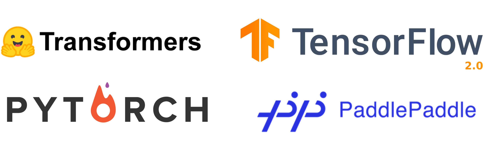

# Topic-Specific Resources


## Classification and Regression


## Deep Learning and NN Architecture


### Transformers

#### ashishpatel26's Treasure of Transformers

```info
:::: 
:: Tagline: 💁 Awesome Treasure of Transformers Models for Natural Language processing contains papers, videos, blogs, official repo along with colab Notebooks. 🛫☑️
:: Repository: <https://github.com/ashishpatel26/Treasure-of-Transformers>
```

{{#tile
:: 
}}

## Specific ML Frameworks

### PyTorch

##### PyTorch 101 Tutorial Series

```info
:: Link: <https://blog.paperspace.com/pytorch-101-understanding-graphs-and-automatic-differentiation>
:: Repository: <https://github.com/Paperspace/PyTorch-101-Tutorial-Series>
```
The repository link contains interactive notebooks corresponding to each blog post in the series.

**Series Contents:**
+ [Understanding Graphs, Automatic Differentiation and Autograd](https://blog.paperspace.com/pytorch-101-understanding-graphs-and-automatic-differentiation/)
+ [Building Your First Neural Network](https://blog.paperspace.com/pytorch-101-building-neural-networks/)
+ [Going Deep with PyTorch](https://blog.paperspace.com/pytorch-101-understanding-graphs-and-automatic-differentiation/blog.paperspace.com/pytorch-101-advanced/)
+ [Memory Management and Using Multiple GPUs](https://blog.paperspace.com/pytorch-101-understanding-graphs-and-automatic-differentiation/blog.paperspace.com/pytorch-memory-multi-gpu-debugging/)
+ [Understanding Hooks](https://blog.paperspace.com/pytorch-101-understanding-graphs-and-automatic-differentiation/blog.paperspace.com/pytorch-hooks-gradient-clipping-debugging/)

#### bharathgs' *Awesome PyTorch List*

```info
:: Tagline: A comprehensive list of pytorch related content on github,such as different models,implementations,helper libraries,tutorials etc.
:: Repository: <https://github.com/bharathgs/Awesome-pytorch-list>
```

### TensorFlow (+Keras)

##### Hands-On Machine Learning...

```info
:::: 
:: Tagline: <Notes & exercise solutions of Part I from the book: "Hands-On ML with Scikit-Learn, Keras & TensorFlow: Concepts, Tools, and Techniques to Build Intelligent Systems" by Aurelien Geron
:: Repository: <https://github.com/Akramz/Hands-on-Machine-Learning-with-Scikit-Learn-Keras-and-TensorFlow>
```


## Course Material

#### MIT Deep Learning

```info
:: Tagline: Tutorials, assignments, and competitions for MIT Deep Learning related courses.
:: Repository: <https://github.com/lexfridman/mit-deep-learning>
```

Contains links to lecture videos and several Jupyter notebooks and Google Colab notebooks for various task-oriented tutorials.


