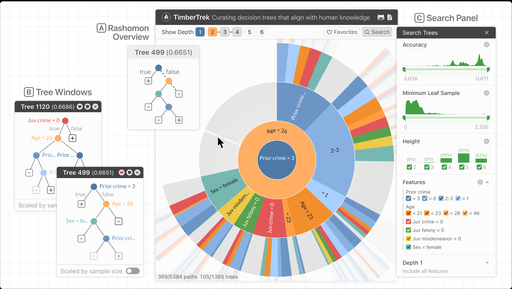

# Demos and Playgrounds

## Anomagram
```info
:: Tagline: Interactive Visualization for Autoencoders with Tensorflow.js
:: Live Demo: <https://anomagram.fastforwardlabs.com/#/>
:: Repository: <https://github.com/victordibia/anomagram>
```

> Anomagram is an interactive experience built with Tensorflow.js to demonstrate how deep neural networks (autoencoders) can be applied to the task of anomaly detection.


## DRLViz
```info
:: Tagline: Online demo of DRLViz, an interactive tool to understand decisions and memory in Deep Reinforcement Learning
:: Live Demo: <https://sical.github.io/drlviz/>
:: Repository: <https://github.com/sical/drlviz>
```

## VisualML

```info
:: Tagline: TODO
:: Live Demo: (multiple --see below)
:: Repository: <https://github.com/dsgiitr/VisualML>
```

> Visual Machine Learning contains a set of Machine Learning and Deep Learning interactive visualisation demos for developing intuition. These demos are developed using TensorFlow.js and can be executed directly in your browser.

**Live demo links:**
1. [ANN](https://dsgiitr.github.io/ann-demo)
2. [Autoencoder](https://dsgiitr.github.io/autoencoder-demo)
3. [Logistic Regression](https://dsgiitr.github.io/logistic-regression-demo)
4. [CNN](https://dsgiitr.github.io/mnist-cnn-demo)
5. [PCA](https://dsgiitr.github.io/pca-demo)
6. [SVM](https://dsgiitr.github.io/svm-demo)
7. [Neural Style Transfer](https://dsgiitr.github.io/neural-style-transfer-tfjs)
8. [Vanishing Gradients & ReLU](https://dsgiitr.github.io/vanishing-gradients-demo)


## RNN Explainer

```info
:: Tagline: An interactive visualization application designed to help non-experts learn about Recurrent Neural Networks (RNNs).
:: Live demo: <https://damien0x0023.github.io/rnnExplainer/>
:: Repository: <https://github.com/damien0x0023/rnnExplainer>
```

```admonish warning
 (Recommendation: "try this demo with a screen which is larger than 8 inches and has a minimum resolution of 1280x720")
```

Hello.

## AttViz

```info
:: Tagline: Self attention made simple; Dissecting Transformers via attention visualization
:: Live demo: <http://attviz.ijs.si/>
:: Repository: <https://github.com/SkBlaz/attviz>
```


## BertViz

```info
:: Tagline: Visualize Attention in NLP Models
:: Live demo: See below
:: Repository: <https://github.com/jessevig/bertviz>
```

> BertViz is an interactive tool for visualizing attention in Transformer language models such as BERT, GPT2, or T5. It can be run inside a Jupyter or Colab notebook through a simple Python API that supports most Huggingface models. BertViz extends the Tensor2Tensor visualization tool by Llion Jones, providing multiple views that each offer a unique lens into the attention mechanism.

The repository link contains information about usage as well as several links to interactive tutorials for use in Colab.


<!--
-->

## attention-viz

```info
:: Tagline: Visualizing query-key interactions in language + vision transformers
:: Live demo: <https://attentionviz.com/>
:: Documentation:: <https://catherinesyeh.github.io/attn-docs/>
:: Repository: <https://github.com/catherinesyeh/attention-viz>
```

> Attention Viz is an interactive tool that visualizes global attention patterns for transformer models. To create this tool, we visualize the joint embeddings of **query** and **key** vectors.


## attentions


```info
:: Tagline: An Apache 2.0 PyTorch implementation of some attentions for Deep Learning Researchers.
:: Repository: <https://github.com/sooftware/attentions>
```


<table>
<thead>
<tr><th colspan=2>Implementation List</th></tr>
<tr style="font-variant: small-caps;"><th>Name</th><th>Citation</th></tr>
</thead>
<tbody>
<tr><td>Additive attention</td><td><a href="https://arxiv.org/pdf/1409.0473.pdf">Bahdanau et al., 2015</a></td></tr>
<tr><td>Dot-product attention</td><td><a href="https://arxiv.org/pdf/1508.04025.pdf">Luong et al., 2015</a></td></tr>
<tr><td>Location-Aware (Location Sensitive) Attention</td><td><a href="http://papers.nips.cc/paper/5847-attention-based-models-for-speech-recognition.pdf">Chorowski et al., 2015</a></td></tr>
<tr><td>Scaled Dot-Product Attention</td><td><a href="https://arxiv.org/abs/1706.03762">Vaswani et al., 2017</a></td></tr>
<tr><td>Multi-Head Attention</td><td><a href="https://arxiv.org/abs/1706.03762">Vaswani et al., 2017</a></td></tr>
<tr><td>Relative Multi-Head Self Attention</td><td><a href="https://arxiv.org/abs/1901.02860">ZihangDai et al., 2019</a></td></tr>
</tbody>
</table>

## CNN Explainer

```info
:: Tagline: Learning Convolutional Neural Networks with Interactive Visualization;<br/>An interactive visualization system designed to help non-experts learn about Convolutional Neural Networks (CNNs)
:: Live demo: <http://poloclub.github.io/cnn-explainer/>
:: Repository: <https://github.com/poloclub/cnn-explainer?tab=readme-ov-file>
```

<!--{{#embed https://youtu.be/HnWIHWFbuUQ }}-->
<!--<iframe width="560" height="315" src="https://www.youtube-nocookie.com/embed/HnWIHWFbuUQ?si=Ri26ECN1J4bvGheD" title="YouTube video player" frameborder="0" allow="accelerometer; autoplay; clipboard-write; encrypted-media; gyroscope; picture-in-picture; web-share" allowfullscreen></iframe>-->
<a title="Watch on YouTube" tooltip="Watch on YouTube" href="https://youtu.be/HnWIHWFbuUQ"><image src="2023-12-11-16-14-44.png"/></a>


## Diffusion Explainer

```info
:: Tagline: Diffusion Explainer: Visual Explanation for Text-to-image Stable Diffusion
:: Live demo: <http://poloclub.github.io/diffusion-explainer>
:: Demo video: <https://youtu.be/Zg4gxdIWDds>
:: Research paper: <https://arxiv.org/abs/2305.03509>
:: Blog post: <https://medium.com/@seongminleee/77b53f4f1c4>
:: Repository: <https://github.com/poloclub/diffusion-explainer>
```


## Wizmap

```info
:: Tagline: Explore and interpret large embeddings in your browser with interactive visualization! 📍
:: Live demo: <https://poloclub.github.io/wizmap>
:: Demo video: <https://youtu.be/8fJG87QVceQ>
:: Research paper: <https://arxiv.org/abs/2306.09328>
:: Repository: <https://github.com/poloclub/wizmap>
```

The repository includes an [interactive notebook](https://github.com/poloclub/wizmap/blob/main/example/imdb.ipynb) containing instructions for using your own embeddings with WizMap.

> WizMap is a scalable interactive visualization tool to help you easily explore large machine learning embeddings. With a novel multi-resolution embedding summarization method and a familiar map-like interaction design, WizMap allows you to navigate and interpret embedding spaces with ease.


<table>
  <tbody><tr>
    <td><a href="https://poloclub.github.io/wizmap/?dataset=diffusiondb" rel="nofollow"></a></td>
    <td><a href="https://poloclub.github.io/wizmap/?dataset=diffusiondb" rel="nofollow"></a></td>
    <td><a href="https://poloclub.github.io/wizmap/?dataset=diffusiondb" rel="nofollow"></a></td>
  </tr>
  <tr></tr>
  <tr>
    <td><a href="https://poloclub.github.io/wizmap/?dataset=diffusiondb" rel="nofollow">DiffusionDB Prompts + Images</a></td>
    <td><a href="https://poloclub.github.io/wizmap/?dataset=acl-abstracts" rel="nofollow">ACL Paper Abstracts</a></td>
    <td><a href="https://poloclub.github.io/wizmap/?dataset=imdb" rel="nofollow">IMDB Review Comments</a></td>
  </tr>
  <tr></tr>
  <tr>
    <td>1.8M text + 1.8M images</td>
    <td>63k text</td>
    <td>25k text</td>
  </tr>
  <tr></tr>
  <tr>
    <td><code>CLIP</code> Embedding</td>
    <td><code>all-MiniLM-L6-v2</code> Embedding</td>
    <td><code>all-MiniLM-L6-v2</code> Embedding</td>
  </tr>
  <tr></tr>
</tbody></table>

## GanLab

```info
:: Tagline: GAN Lab: An Interactive, Visual Experimentation Tool for Generative Adversarial Networks
:: Live demo: <https://poloclub.github.io/ganlab/>
:: Repository: <https://github.com/poloclub/ganlab?tab=readme-ov-file>
```


## TimberTrek

```info
:: Tagline: Explore and compare 1K+ accurate decision trees in your browser!
:: Live demo: <https://poloclub.github.io/timbertrek>
:: Demo video: <https://youtu.be/3eGqTmsStJM>
:: Conference Talk: <https://youtu.be/l1mr9z1TuAk>
:: Research paper: <https://arxiv.org/abs/2209.09227>
:: Colab notebook: <https://github.com/ubc-systopia/treeFarms/blob/main/treefarms/tutorial.ipynb>
:: Repository: <https://github.com/poloclub/timbertrek>
```



## GAM Coach

```info
:: Tagline: An interactive tool to help everyday users discover actionable strategies to obtain desired AI decisions.
:: Live demo: <https://poloclub.github.io/gam-coach/>
:: Demo video: <https://youtu.be/ubacP34H9XE>
:: Research paper: <https://arxiv.org/abs/2302.14165>
:: Repository: <https://github.com/poloclub/gam-coach>
```

.png)


## Interactive Classification

```info
:: Tagline: Interactive Classification for Deep Learning Interpretation
:: Live demo: <https://cabreraalex.github.io/interactive-classification/>
:: Repository: <https://github.com/poloclub/interactive-classification>
```

The live demo includes a "tour"-style tutorial.

> Interactive Classification allows you to explore how computers see by modifying images.

<a href="https://youtu.be/llub5GcOF6w" rel="nofollow" title="YouTube video demo" tooltip="YouTube video demo"></a>


## WebSHAP

```info
:: Tagline: JavaScript library to explain any machine learning models anywhere!
:: Live Demo: (See below.)
:: Library documentation: <http://poloclub.github.io/webshap/doc>
:: Research paper: <https://arxiv.org/abs/2303.09545>
:: Repository: <https://github.com/poloclub/webshap>
```


**Live Demo List** (see Repository README.md for more info)

1. [Financial ML model for predictive classification](https://poloclub.github.io/webshap/?model=tabular)

2. [Convolutional NN for image classification](https://poloclub.github.io/webshap/?model=image) 

3. [Transformer-based text classifier](https://poloclub.github.io/webshap/?model=text)


## Bluff

```info
:: Tagline: Bluff: Interactively Deciphering Adversarial Attacks on Deep Neural Networks
:: Live Demo: <https://poloclub.github.io/bluff/>
:: Demo video: <https://youtu.be/b6PHyYnassc>
:: Research paper: <https://arxiv.org/pdf/2009.02608.pdf>
:: Repository: <https://github.com/poloclub/bluff>
```
