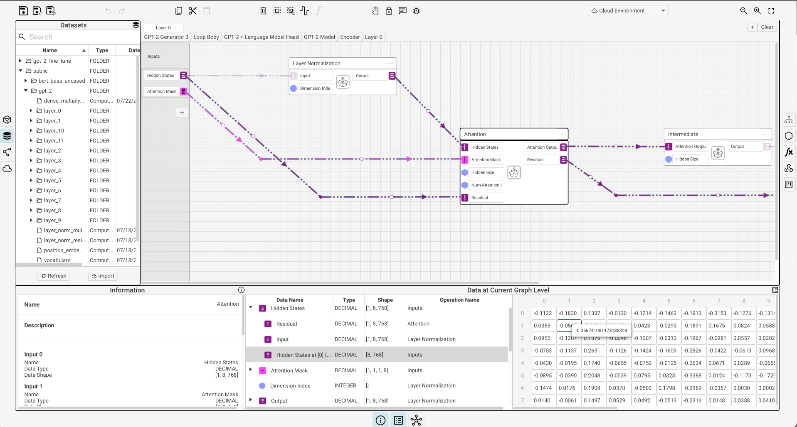

# Dev Tools {.pagetoc-exclude}

## NN Design Software

#### Cerbrec Graphbook {.pagetoc-exclude}

```info
:: Tagline: AI Modeling, Made Intuitive;<br/>The diagramming platform that allows data scientists to focus on model architecture
:: Documentation: <https://cerbrec.com/documentation>
:: YouTube channel: <https://www.youtube.com/@Graphbook>
:: Slack community: <https://cerbrec-community.slack.com/ssb/redirect>
:: Repository: <https://github.com/cerbrec/graphbook>
```

{{#tile
:: 
}}

> Graphbook is a new visual IDE for AI and deep learning model development that lets you build and run directly on a visualization. For example, you can customize transformers directly in the platform, train, and serve them to a URL. Graphbook is still in beta mode and we are developing more models and product features over time.

The Github repository contains a number of [NLP models](https://github.com/cerbrec/graphbook/tree/master/nlp_models), grouped into the following categories:
+ Classifiers
+ Generators
+ Next Token
+ Tokenizers
+ Transformers

There is also a small [Community Gallery](https://github.com/cerbrec/graphbook/tree/master/community_gallery).

A Python scripting interface ("PyGraphbook") is [in progress](https://github.com/cerbrec/graphbook/tree/master/PyGraphbook).

## NN Visualization Tools

#### nn_vis {.pagetoc-exclude}
```info
:: Website: <https://github.com/julrog/nn_vis>
```


#### Collection of NN Architecture Visualization Tools {.pagetoc-exclude}

```info
:: Tagline: Tools to Design or Visualize Architecture of Neural Network
:: Repository: <https://github.com/ashishpatel26/Tools-to-Design-or-Visualize-Architecture-of-Neural-Network>
```

## NN Architecture "Zoos"

### modelzoo.co {.pagetoc-exclude}

```info
:: Link: <https://modelzoo.co/>
```

Models are grouped by framework (ex. PyTorch, TensorFlow) as well as by category (Computer Vision, NLP, RL, etc).


## Reinforcement Learning Misc.

#### DeepRTS {.pagetoc-exclude}