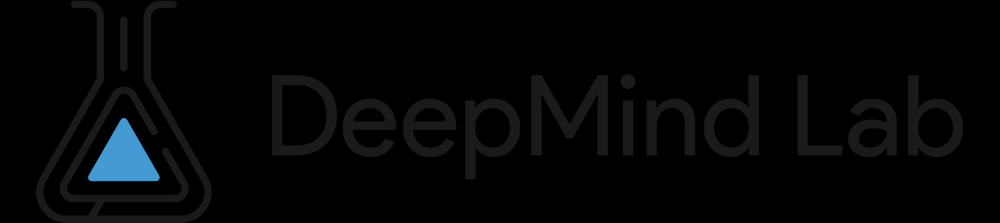

# ML Frameworks {.pagetoc-exclude}


## C/C++ Frameworks

#### DeepC {.pagetoc-exclude}

```info
:: Tagline: vendor independent TinyML deep learning library, compiler and inference framework microcomputers and micro-controllers
:: Repository: <https://github.com/ai-techsystems/deepC>
```
Repository README.md contains links to colab notebook and other reference material.

> The deepC is a vendor independent deep learning library, compiler and inference framework designed for small form-factor devices including μControllers, IoT and Edge devices.

{{#tile
:: 
}}


## Python Frameworks


#### OpenPrompt

```info
:::: 
:: Tagline: An Open-Source Framework for Prompt-Learning.
:: Repository: <https://github.com/thunlp/OpenPrompt>
```

See also [UltraChat](https://github.com/thunlp/UltraChat).

{{#tile
:: 
}}

## Julia Frameworks

#### Flux

```info
:::: 
:: Tagline: The Elegant Machine Learning Stack
:: Website: <https://fluxml.ai/>
:: Repository: <https://github.com/FluxML/Flux.jl>
```

> Flux is a 100% pure-Julia stack and provides lightweight abstractions on top of Julia's native GPU and AD support. It makes the easy things easy while remaining fully hackable.

{{#tile
:: 
}}


#### MLJ

```info
:::: 
:: Tagline: A Julia machine learning framework
:: Learning guides: <https://alan-turing-institute.github.io/MLJ.jl/dev/learning_mlj/>
:: Documentation: <https://alan-turing-institute.github.io/MLJ.jl/dev/>
:: Cheatsheet: <https://alan-turing-institute.github.io/MLJ.jl/dev/mlj_cheatsheet/>
:: Repository: <https://github.com/alan-turing-institute/MLJ.jl>
```

> MLJ (Machine Learning in Julia) is a toolbox written in Julia providing a common interface and meta-algorithms for selecting, tuning, evaluating, composing and comparing about 200 machine learning models written in Julia and other languages.

Focus is mainly not on Deep Learning techniques.


## Other Languages


## Framework Interop


## Reinforcement Learning initiatives

#### DeepRTS
```info
:: Tagline: A Real-Time-Strategy game for Deep Learning research
:: Repository: <https://github.com/cair/deep-rts>
```

> DeepRTS is a high-performance Real-TIme strategy game for Reinforcement Learning research. It is written in C++ for performance, but provides an python interface to better interface with machine-learning toolkits. Deep RTS can process the game with over 6 000 000 steps per second and 2 000 000 steps when rendering graphics. In comparison to other solutions, such as StarCraft, this is over 15 000% faster simulation time running on Intel i7-8700k with Nvidia RTX 2080 TI.
> 
> The aim of Deep RTS is to bring a more affordable and sustainable solution to RTS AI research by reducing computation time.

{{#tile 
:: 
}}

#### Google Deepmind's `lab`

```info
:::: 
:: Tagline: A customisable 3D platform for agent-based AI research
:: Repository: <https://github.com/google-deepmind/lab>
```

> DeepMind Lab is a 3D learning environment based on id Software's [Quake III Arena](https://github.com/id-Software/Quake-III-Arena) via [ioquake3](https://github.com/ioquake/ioq3) and [other open source software](https://github.com/google-deepmind/lab?tab=readme-ov-file#upstream-sources).
>
> DeepMind Lab provides a suite of challenging 3D navigation and puzzle-solving tasks for learning agents. Its primary purpose is to act as a testbed for research in artificial intelligence, especially deep reinforcement learning.

(Click the images below to watch each of the three demo videos on YouTube.)

{{#tile
:: <a href="https://www.youtube.com/watch?v=M40rN7afngY" rel="nofollow"></a>
:: <a href="https://www.youtube.com/watch?v=gC_e8AHzvOw" rel="nofollow"></a>
:: <a href="https://www.youtube.com/watch?v=7syZ42HWhHE" rel="nofollow"></a>
}}


### Gymnasium

```info
:::: 
:: Tagline: An API standard for single-agent reinforcement learning environments, with popular reference environments and related utilities
:: Documentation: <https://gymnasium.farama.org/>
:: Repository: <https://github.com/Farama-Foundation/Gymnasium>
```

Successor to OpenAI's Gym ([website](https://www.gymlibrary.dev/), [repository](https://github.com/openai/gym)).

> Gymnasium includes the following families of environments along with a wide variety of third-party environments
> 
> [Classic Control](https://gymnasium.farama.org/environments/classic_control/) - These are classic reinforcement learning based on real-world problems and physics.
> 
> [Box2D](https://gymnasium.farama.org/environments/box2d/) - These environments all involve toy games based around physics control, using box2d based physics and PyGame-based rendering
> 
> [Toy Text](https://gymnasium.farama.org/environments/toy_text/) - These environments are designed to be extremely simple, with small discrete state and action spaces, and hence easy to learn. As a result, they are suitable for debugging implementations of reinforcement learning algorithms.
> 
> [MuJoCo](https://gymnasium.farama.org/environments/mujoco/) - A physics engine based environments with multi-joint control which are more complex than the Box2D environments.
> 
> [Atari](https://gymnasium.farama.org/environments/atari/) - A set of 57 Atari 2600 environments simulated through Stella and the Arcade Learning Environment that have a high range of complexity for agents to learn.
> 
> [Third-party](https://gymnasium.farama.org/environments/third_party_environments/) - A number of environments have been created that are compatible with the Gymnasium API. Be aware of the version that the software was created for and use the apply_env_compatibility in gymnasium.make if necessary.


