# ML Libraries {.pagetoc-exclude}

## AutoML

### Python

#### Optuna {.spotlight}

```info
:::: 
:: Tagline: A hyperparameter optimization framework
:: Documentation: <https://optuna.readthedocs.io/en/stable/>
```

> Optuna is an automatic hyperparameter optimization software framework, particularly designed for machine learning. It features an imperative, define-by-run style user API. Thanks to our define-by-run API, the code written with Optuna enjoys high modularity, and the user of Optuna can dynamically construct the search spaces for the hyperparameters.

> Optuna has modern functionalities as follows:
> 
> + Lightweight, versatile, and platform agnostic architecture
>   
>      *Handle a wide variety of tasks with a simple installation that has few requirements.*
>
> + Pythonic search spaces
>
    *Define search spaces using familiar Python syntax including conditionals and loops.*
>
> + Efficient optimization algorithms
>
>    *Adopt state-of-the-art algorithms for sampling hyperparameters and efficiently pruning unpromising trials.*
> 
> + Easy parallelization
>
>    *Scale studies to tens or hundreds of workers with little or no changes to the code.*
>
> + Quick visualization
>
>    *Inspect optimization histories from a variety of plotting functions.*

Optuna is popular and is generally regarded as accessible to beginners.

#### Hyperopt {.pagetoc-exclude}

```info
:::: 
:: Tagline: Distributed Asynchronous Hyper-parameter Optimization
:: Documentation: <https://hyperopt.github.io/hyperopt/>
:: Repository: <https://github.com/hyperopt/hyperopt>
:: Related links: <https://hyperopt.github.io/>
```

> Hyperopt is a Python library for serial and parallel optimization over awkward search spaces, which may include real-valued, discrete, and conditional dimensions.

> Currently three algorithms are implemented in hyperopt:
> 
> + Random Search
> + Tree of Parzen Estimators (TPE)
> + Adaptive TPE
> 
> Hyperopt has been designed to accommodate Bayesian optimization algorithms based on Gaussian processes and regression trees, but these are not currently implemented.
> 
> All algorithms can be parallelized in two ways, using:
> 
> + Apache Spark
> + MongoDB

HyperOpt is also extremely popular.


#### NNI {.pagetoc-exclude}

```info
:::: 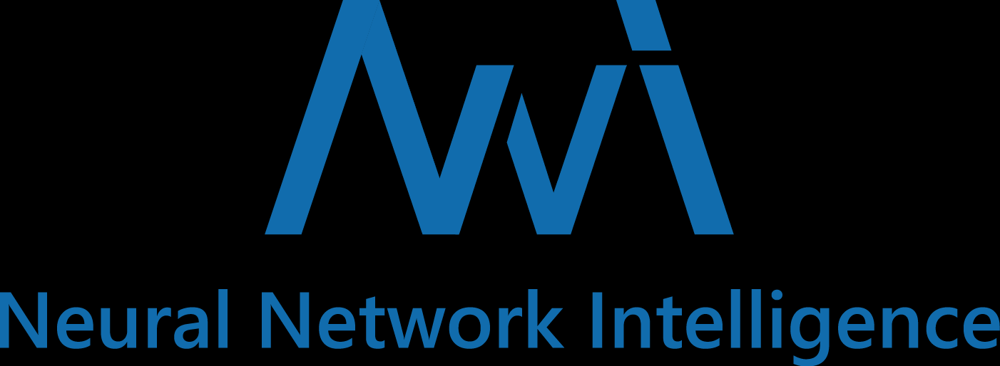
:: Tagline: An open source AutoML toolkit for automate machine learning lifecycle, including feature engineering, neural architecture search, model compression and hyper-parameter tuning.
:: Documentation: <https://nni.readthedocs.io/>
:: Repository: <https://github.com/microsoft/nni>
```

> NNI automates feature engineering, neural architecture search, hyperparameter tuning, and model compression for deep learning. Find the latest features, API, examples and tutorials in our [official documentation](https://nni.readthedocs.io/).

The documentation has several tutorials and quick-start guides for a variety of situations, but its coverage for nonstandard operations is less than thorough (and in some places is outdated and/or self-contradictory).


#### Auto-PyTorch {.pagetoc-exclude}
```info
:: Tagline: Automatic architecture search and hyperparameter optimization for PyTorch
:: Documentation: <https://automl.github.io/Auto-PyTorch/master>
:: Repository: <https://github.com/automl/Auto-PyTorch>
```

> While early AutoML frameworks focused on optimizing traditional ML pipelines and their hyperparameters, another trend in AutoML is to focus on neural architecture search. To bring the best of these two worlds together, we developed Auto-PyTorch, which jointly and robustly optimizes the network architecture and the training hyperparameters to enable fully automated deep learning (AutoDL).
> 
> Auto-PyTorch is mainly developed to support tabular data (classification, regression) and time series data (forecasting). The newest features in Auto-PyTorch for tabular data are described in the paper "Auto-PyTorch Tabular: Multi-Fidelity MetaLearning for Efficient and Robust AutoDL" (see below for bibtex ref). Details about Auto-PyTorch for multi-horizontal time series forecasting tasks can be found in the paper "Efficient Automated Deep Learning for Time Series Forecasting".

#### FLAML {.pagetoc-exclude}
```info
:::: 
:: Tagline: A fast library for AutoML and tuning
:: Website: <https://microsoft.github.io/FLAML/>
:: Discord server: <https://discord.gg/Cppx2vSPVP>
:: Repository: <https://github.com/microsoft/FLAML>
```
> FLAML is a lightweight Python library for efficient automation of machine learning and AI operations. It automates workflow based on large language models, machine learning models, etc. and optimizes their performance.

> FLAML enables building next-gen GPT-X applications based on multi-agent conversations with minimal effort. It simplifies the orchestration, automation and optimization of a complex GPT-X workflow. It maximizes the performance of GPT-X models and augments their weakness.
> 
> For common machine learning tasks like classification and regression, it quickly finds quality models for user-provided data with low computational resources. It is easy to customize or extend. Users can find their desired customizability from a smooth range.
> 
> It supports fast and economical automatic tuning (e.g., inference hyperparameters for foundation models, configurations in MLOps/LMOps workflows, pipelines, mathematical/statistical models, algorithms, computing experiments, software configurations), capable of handling large search space with heterogeneous evaluation cost and complex constraints/guidance/early stopping.

#### Featuretools {.pagetoc-exclude}
```info
:::: 
:: Tagline: An open source python framework for automated feature engineering
:: Website: <https://www.featuretools.com/>
```

> Featuretools automatically creates features from temporal and relational datasets.

{{#tile
:: 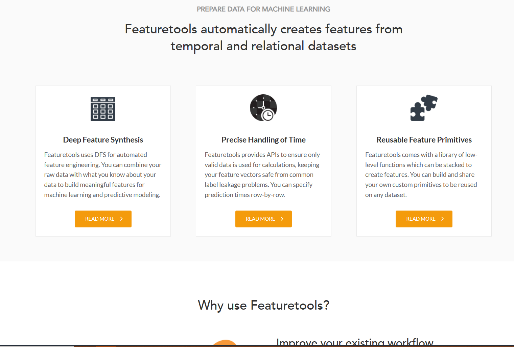
:: 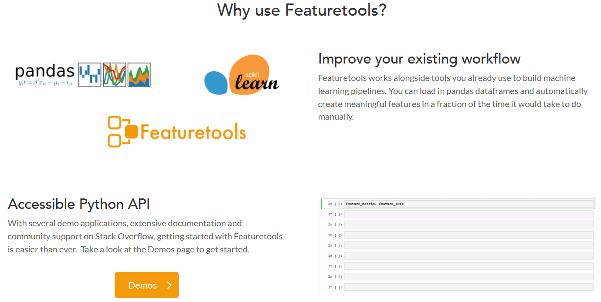
:: 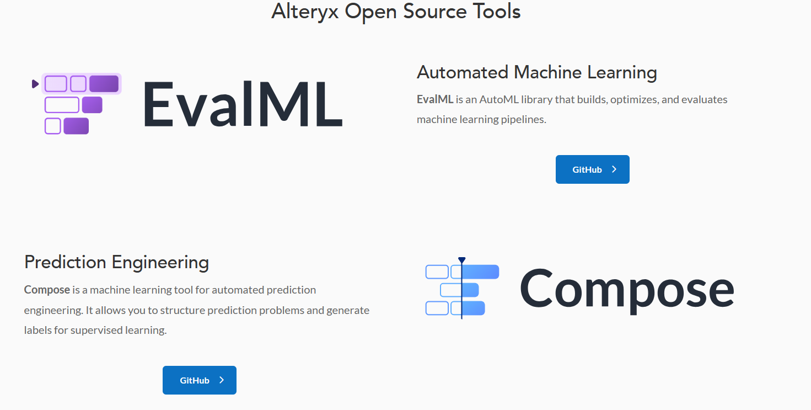
}}

#### DeepHyper {.pagetoc-exclude}
```info
:::: 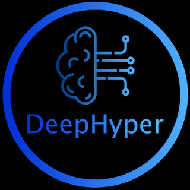
:: Tagline: Distributed Neural Architecture and Hyperparameter Optimization for Machine Learning
:: Website: <https://deephyper.readthedocs.io/en/latest/>
```

> DeepHyper is a powerful Python package for automating machine learning tasks, particularly focused on optimizing hyperparameters, searching for optimal neural architectures, and quantifying uncertainty through the deep ensembles. With DeepHyper, users can easily perform these tasks on a single machine or distributed across multiple machines, making it ideal for use in a variety of environments. Whether you’re a beginner looking to optimize your machine learning models or an experienced data scientist looking to streamline your workflow, DeepHyper has something to offer. So why wait? Start using DeepHyper today and take your machine learning skills to the next level!

#### AutoGluon {.pagetoc-exclude}
```info
:::: 
:: Tagline: AutoML for Image, Text, Time Series, and Tabular Data
:: Website: <https://auto.gluon.ai/stable/index.html>
```

See the website for several Quick Start guides and tutorials.

#### AdaNet {.pagetoc-exclude}

```info
:::: 
:: Tagline: AdaNet is a TensorFlow framework for fast and flexible AutoML with learning guarantees.
:: Website: <https://adanet.readthedocs.io/en/v0.9.0/>
```

> AdaNet is a lightweight TensorFlow-based framework for automatically learning high-quality models with minimal expert intervention. AdaNet builds on recent AutoML efforts to be fast and flexible while providing learning guarantees. Importantly, AdaNet provides a general framework for not only learning a neural network architecture, but also for learning to ensemble to obtain even better models.

#### Neuraxio {.pagetoc-exclude}
```info
:::: 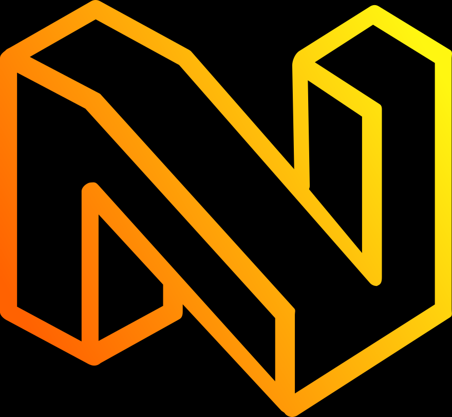
:: Tagline: Code Machine Learning Pipelines - The Right Way.
:: Repository: <https://github.com/Neuraxio/Neuraxle>
```

```admonish quote
> The world's cleanest AutoML library ✨ - Do hyperparameter tuning with the right pipeline abstractions to write clean deep learning production pipelines. Let your pipeline steps have hyperparameter spaces. Design steps in your pipeline like components. Compatible with Scikit-Learn, TensorFlow, and most other libraries, frameworks and MLOps environments.
```

--- 

## Time series

### Python

#### Temporian {.pagetoc-exclude}
```info
:::: 
:: Tagline: Temporian is to temporal data what Pandas is to tabular data.
:: Website: <https://temporian.readthedocs.io/en/stable/>
```

> Temporian is a library for safe, simple and efficient preprocessing and feature engineering of temporal data in Python. Temporian supports multivariate time-series, multivariate time-sequences, event logs, and cross-source event streams.


#### functime {.pagetoc-exclude}
```info
:::: 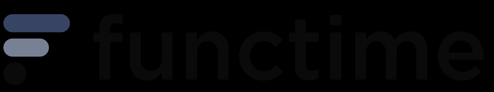
:: Tagline: Production-ready time series models
:: Website: <https://www.functime.ai/>
:: Tutorial: <https://docs.functime.ai/forecasting/>
:: Documentation: <https://docs.functime.ai/>
```

> functime is a machine learning library for time-series predictions that just works.
> 
> - Fully-featured: Powerful and easy-to-use API for [forecasting](https://docs.functime.ai/#forecasting-highlights) and [feature engineering](https://docs.functime.ai/#feature-engineering-highlights) (tsfresh, Catch22).
> - Fast: Forecast [100,000 time series](https://docs.functime.ai/#global-forecasting) in seconds *on your laptop*
> - Efficient: Extract 100s of time-series features in parallel using [Polars](https://www.pola.rs/)
> - Battle-tested: Algorithms that deliver real business impact and win competitions
<!--TODO: Images-->

#### tsflex {.pagetoc-exclude}
```info
:: Tagline: flexible time-series operations
:: Website: <https://predict-idlab.github.io/tsflex/>
```

> tsflex ... \[is\] a sequence first Python toolkit for processing & feature extraction, making few assumptions about input data.
> This makes tsflex suitable for use-cases such as inference on streaming data, performing operations on irregularly sampled series, a holistic approach for operating on multivariate asynchronous data, and dealing with time-gaps.

<!--TODO: Images-->

#### GluonTS {.pagetoc-exclude}

```info
:: Tagline: GluonTS is a Python package for probabilistic time series modeling, focusing on deep learning based models, based on PyTorch and MXNet.
:: Website: <https://ts.gluon.ai/stable/index.html>
```

<!--TODO: Images-->

#### PyTorch-Forecasting {.pagetoc-exclude}

```info
:: Website: <https://pytorch-forecasting.readthedocs.io/en/stable/>
```

<!--TODO: Images-->

---

## Explainable DL

### Python

#### Logic Explained Networks {.pagetoc-exclude}

```info
:: Tagline: Logic Explained Networks is a python repository implementing explainable-by-design deep learning models.
:: Repository: <https://github.com/pietrobarbiero/logic_explained_networks>
```

> The Logic Explained Network is a python repository providing a set of utilities and modules to build deep learning models that are explainable by design. This library provides both already implemented LENs classes and APIs classes to get First-Order Logic (FOL) explanations from neural networks.

{{#tile
:: 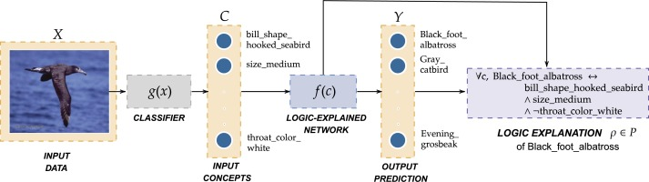
:: 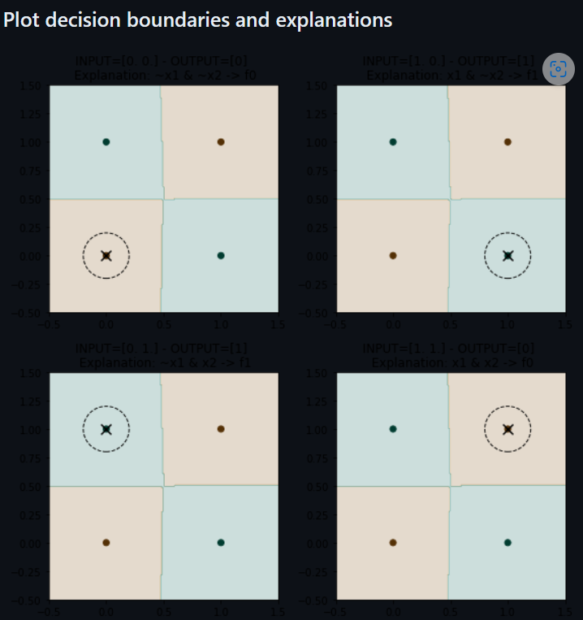
}}

---

## Streaming ML

#### River {.pagetoc-exclude}

```info
:: Tagline: River is a Python library for online machine learning. It aims to be the most user-friendly library for doing machine learning on streaming data. River is the result of a merger between creme and scikit-multiflow.
:: Website: <https://riverml.xyz/latest/>
```

```admonish info
See also **`deep-river`** at <https://github.com/online-ml/deep-river>: "deep-river is a Python library for online deep learning. deep-river's ambition is to enable online machine learning for neural networks. It combines the river API with the capabilities of designing neural networks based on PyTorch."
```

<!--TODO: Images-->

---

## Plotting and Data Visualization

### Python

#### `seaborn` {.spotlight}

```info
:: Website: <https://seaborn.pydata.org>
:: Showcase: <https://seaborn.pydata.org/examples/index.html>
:: Tutorial: <https://seaborn.pydata.org/tutorial.html>
```

<!--TODO: Images-->

#### Perspective {.pagetoc-exclude}
```info
:: Website: <https://perspective.finos.org/>
```

> Perspective is an interactive analytics and data visualization component, which is especially well-suited for large and/or streaming datasets. Use it to create user-configurable reports, dashboards, notebooks and applications, then deploy stand-alone in the browser, or in concert with Python and/or Jupyterlab.

<!--TODO: Images-->

---

## `scikit-learn` alternatives

#### PyCaret {.spotlight}
```info
:: Tagline: PyCaret is an open-source, low-code machine learning library in Python that automates machine learning workflows.
:: Website: <https://pycaret.org/>
```

<!--TODO: Images-->


---

## Architecture-Specific

### Transformers

#### Python

##### HuggingFace `transformers`

```info
:: Tagline: 🤗 Transformers: State-of-the-art Machine Learning for Pytorch, TensorFlow, and JAX.
:: Documentation: <https://huggingface.co/transformers>
:: Repository: <https://github.com/huggingface/transformers>
```

See also [this list](https://github.com/huggingface/transformers/blob/main/awesome-transformers.md) of "Awesome projects built with transformers."


----

## NLP

### Python

#### spaCy {.pagetoc-exclude}

```info
:: Tagline: Industrial-strength NLP
:: "spaCy 101": <https://spacy.io/usage/spacy-101>
:: Online course: <https://course.spacy.io/>
:: Videos: <https://www.youtube.com/c/ExplosionAI>
:: Usage guides: <https://spacy.io/usage/>
:: Project Templates: <https://github.com/explosion/projects>
:: Models: <https://spacy.io/models>
:: API Docs: <https://spacy.io/api/>
:: Universe: <https://spacy.io/universe>
:: VS Code Ext.: <https://github.com/explosion/spacy-vscode>
:: Website: <https://spacy.io/>
:: Examples: <https://github.com/explosion/spaCy/tree/master/examples>
:: Repository: <https://github.com/explosion/spaCy>
```

> spaCy is a library for advanced Natural Language Processing in Python and Cython. It's built on the very latest research, and was designed from day one to be used in real products.
> 
> spaCy comes with [pretrained pipelines](https://spacy.io/models) and currently supports tokenization and training for 70+ languages. It features state-of-the-art speed and neural network models for tagging, parsing, named entity recognition, text classification and more, multi-task learning with pretrained transformers like BERT, as well as a production-ready [training system](https://spacy.io/usage/training) and easy model packaging, deployment and workflow management. spaCy is commercial open-source software, released under the [MIT license](https://github.com/explosion/spaCy/blob/master/LICENSE).

Appears to use PyTorch for GPU support.

<iframe scrolling="no" height="855" width="600" src="https://spacy.io/#quickstart" style="object-position:center;object-fit:fill;margin: 0 auto;display: block;"></iframe>

#### FARM (Framework for Adapting Representation Models) {.pagetoc-exclude}

```info
:::: 
:: Tagline: 🏡 Fast & easy transfer learning for NLP. Harvesting language models for the industry. Focus on Question Answering.
:: Documentation: <https://farm.deepset.ai/>
:: Repository: <https://github.com/deepset-ai/FARM>
```

#### Contextualized Topic Models {.pagetoc-exclude}

```info
:::: 
:: Tagline: A python package to run contextualized topic modeling. CTMs combine contextualized embeddings (e.g., BERT) with topic models to get coherent topics. Published at EACL and ACL 2021.
:: Repository: <https://github.com/MilaNLProc/contextualized-topic-models>
```

> Contextualized Topic Models (CTM) are a family of topic models that use pre-trained representations of language (e.g., BERT) to support topic modeling. See the papers for details:
> - Bianchi, F., Terragni, S., & Hovy, D. (2021). Pre-training is a Hot Topic: Contextualized Document Embeddings Improve Topic Coherence. ACL. <https://aclanthology.org/2021.acl-short.96/>
> - Bianchi, F., Terragni, S., Hovy, D., Nozza, D., & Fersini, E. (2021). Cross-lingual Contextualized Topic Models with Zero-shot Learning. EACL. <https://www.aclweb.org/anthology/2021.eacl-main.143/>

> Our new topic modeling family supports many different languages (i.e., the one supported by HuggingFace models) and comes in two versions: CombinedTM combines contextual embeddings with the good old bag of words to make more coherent topics; ZeroShotTM is the perfect topic model for task in which you might have missing words in the test data and also, if trained with multilingual embeddings, inherits the property of being a multilingual topic model!
> 
> The big advantage is that you can use different embeddings for CTMs. Thus, when a new embedding method comes out you can use it in the code and improve your results. We are not limited by the BoW anymore.

> An important aspect to take into account is which network you want to use: the one that combines contextualized embeddings and the BoW ([CombinedTM](https://contextualized-topic-models.readthedocs.io/en/latest/combined.html)) or the one that just uses contextualized embeddings ([ZeroShotTM](https://contextualized-topic-models.readthedocs.io/en/latest/zeroshot.html)).
> 
> But remember that you can do zero-shot cross-lingual topic modeling only with the [ZeroShotTM](https://contextualized-topic-models.readthedocs.io/en/latest/zeroshot.html) model.
> 
> Contextualized Topic Models also support supervision ([SuperCTM](https://contextualized-topic-models.readthedocs.io/en/latest/introduction.html)).
>
> 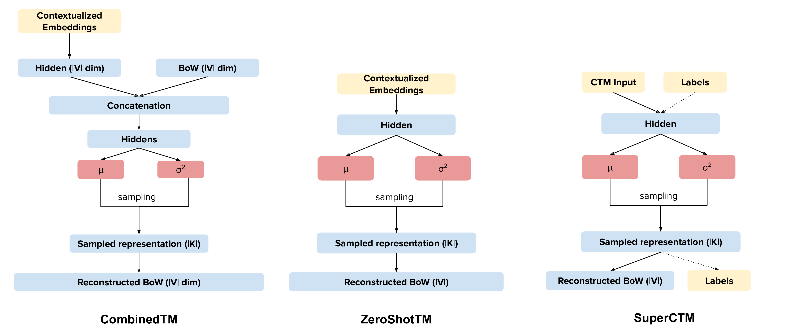
> 
> We also have [Kitty](https://contextualized-topic-models.readthedocs.io/en/latest/kitty.html): a new submodule you can use to create a human-in-the-loop classifier to quickly classify your documents and create named clusters. This can be very useful to do document filtering. It also works in cross-lingual setting and thus you might be able to filter documents in a language you don't know!

Repository README.md includes links to four Google Colab tutorial notebooks. 

CUDA GPU support via PyTorch.


#### skweak {.pagetoc-exclude}

```info
:::: 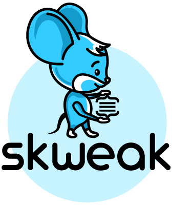
:: Tagline: A software toolkit for weak supervision applied to NLP tasks
:: Repository: <https://github.com/NorskRegnesentral/skweak>
```

> Labelled data remains a scarce resource in many practical NLP scenarios. This is especially the case when working with resource-poor languages (or text domains), or when using task-specific labels without pre-existing datasets. The only available option is often to collect and annotate texts by hand, which is expensive and time-consuming.
>  
> skweak (pronounced /skwi:k/) is a Python-based software toolkit that provides a concrete solution to this problem using weak supervision. skweak is built around a very simple idea: Instead of annotating texts by hand, we define a set of labelling functions to automatically label our documents, and then aggregate their results to obtain a labelled version of our corpus.
> 
> The labelling functions may take various forms, such as domain-specific heuristics (like pattern-matching rules), gazetteers (based on large dictionaries), machine learning models, or even annotations from crowd-workers. The aggregation is done using a statistical model that automatically estimates the relative accuracy (and confusions) of each labelling function by comparing their predictions with one another.
> 
> skweak can be applied to both sequence labelling and text classification, and comes with a complete API that makes it possible to create, apply and aggregate labelling functions with just a few lines of code. The toolkit is also tightly integrated with SpaCy, which makes it easy to incorporate into existing NLP pipelines. Give it a try!

----

## Medical Imaging

### Python

#### MedicalZooPytorch

```info
:: Tagline: A pytorch-based deep learning framework for multi-modal 2D/3D medical image segmentation;<br/>A 3D multi-modal medical image segmentation library in PyTorch
:: Repository: <https://github.com/black0017/MedicalZooPytorch>
```

Includes quick-start guide and Colab tutorial notebook.